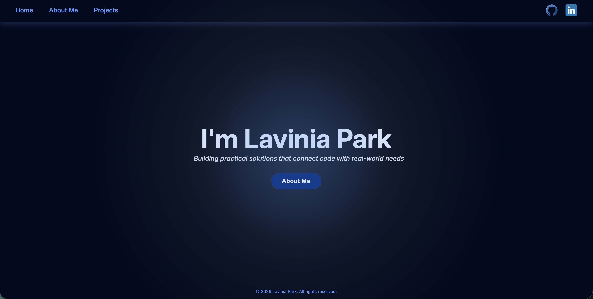

# Personal Portfolio




A personal portfolio website developed with **HTML** and **CSS** to showcase my background, technical skills, professional experience, and projects.

The site was designed with a modern visual approach, smooth animations, and a structured layout focused on clarity, consistency, and presentation.

## Overview

This portfolio includes the main information from my resume in a more dynamic and visual format. It highlights who I am, the technologies I work with, my professional background, and some of the projects I have built.

## Main Features

- Responsive and modern interface
- Hero section with navigation to About Me
- About Me section with introduction, IT skills, and professional experience
- Projects section with project cards
- Direct access to **Live Demo** and **Source Code**
- Smooth hover effects and visual animations
- Structured layout with attention to consistency and spacing

## Technologies

- HTML5
- CSS3

## Project Structure

- **Hero**: initial presentation section
- **About Me**: summary about me, technical skills, and experience
- **Projects**: selected project cards with links

## How to Run

```bash
# Clone the repository
git clone https://github.com/laviniapark/portfolio-website.git

# Open the project folder
cd portfolio-website
```
Then, simply open the ```index.html``` file in your browser.

## Goals

This project was built to:

- Present my profile in a more visual and professional way
- Practice layout, styling, and consistency
- Create a central place to showcase my work

## Author

**Lavinia Park**